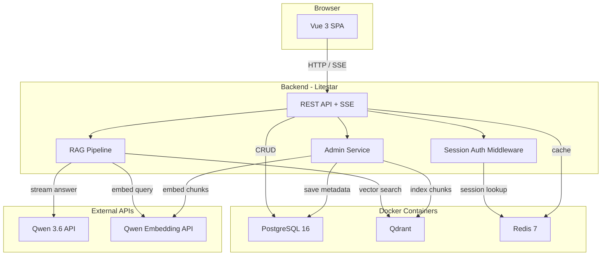

# Архитектура: обзор

ИИ-ассистент для студентов на основе RAG. Веб-приложение: SPA (Vue 3) + async REST API (Litestar/Python) + PostgreSQL + Qdrant + Redis.

## Стек технологий

| Компонент | Решение | Назначение |
|-----------|---------|------------|
| Backend | Python 3.12 + Litestar | Async REST API, SSE-стриминг |
| Frontend | Vue 3 + Vite + Pinia + Vue Router | SPA, реактивный интерфейс |
| LLM | Qwen 3.6 API | Генерация ответов |
| Embeddings | Qwen Embedding API | Векторизация текста |
| Реляционная БД | PostgreSQL 16 | Пользователи, чаты, сообщения, документы, feedback |
| Векторная БД | Qdrant | Хранение и поиск embeddings |
| Кеш / Сессии | Redis 7 | Сессии авторизации, кеш запросов |
| ORM | SQLAlchemy 2.0 (async) | Работа с PostgreSQL |
| Миграции | Alembic | Управление схемой БД |
| RAG-пайплайн | Собственная реализация | Полный контроль без LangChain/LlamaIndex |
| Инфраструктура | Docker Compose | PG, Qdrant, Redis в контейнерах |

## Схема



## Структура проекта

```
project-mentor-ai/
├── backend/
│   ├── src/
│   │   └── app/
│   │       ├── main.py
│   │       ├── config.py
│   │       ├── db/
│   │       ├── auth/
│   │       ├── chat/
│   │       ├── feedback/
│   │       ├── admin/
│   │       └── rag/
│   ├── migrations/
│   ├── tests/
│   ├── scripts/
│   └── requirements.txt
├── frontend/
│   ├── src/
│   │   ├── api/
│   │   ├── stores/
│   │   ├── pages/
│   │   ├── components/
│   │   └── router/
│   └── package.json
├── knowledge_base/
├── docker-compose.yml
└── .env.example
```

## Подробная документация

- [Backend (Litestar)](backend.md)
- [Frontend (Vue 3)](frontend.md)
- [База данных (PostgreSQL)](database.md)
- [Векторная БД (Qdrant)](qdrant.md)
- [Кеш и сессии (Redis)](redis.md)
- [RAG-пайплайн](rag_pipeline.md)
- [API эндпоинты](api.md)
- [Docker и окружение](docker.md)
