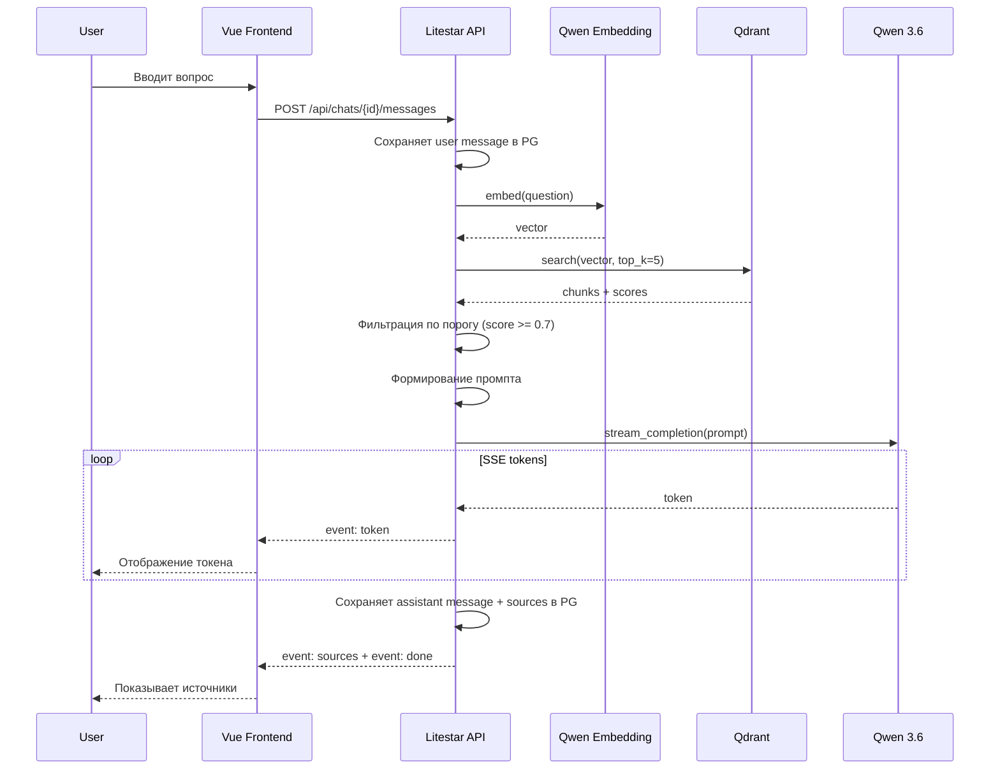

# RAG-пайплайн

Собственная реализация (без LangChain / LlamaIndex). 5 модулей в `backend/src/app/rag/`.

## Схема работы



## Модули

### chunker.py

- **Вход**: путь к файлу (PDF, DOCX, MD)
- **Парсинг**: PyPDF2 (PDF), python-docx (DOCX), markdown (MD)
- **Разбиение**: 500-1000 токенов на фрагмент, overlap ~100 токенов
- **Выход**: список `{text: str, metadata: dict}`
- **Настройки** (из config): `RAG_CHUNK_SIZE=800`, `RAG_CHUNK_OVERLAP=100`

### embedder.py

- **Вход**: текст (строка) или батч (список строк)
- **API**: Qwen Embedding API через httpx (OpenAI-compatible)
- **Модель**: `text-embedding-v3` (задаётся в config)
- **Выход**: vector (list[float]) размерности ~1024
- **Методы**: `embed_text(text) -> list[float]`, `embed_batch(texts) -> list[list[float]]`

### retriever.py

- **Вход**: query vector, top_k, score_threshold
- **Поиск**: `qdrant_client.search()` по коллекции `knowledge_base`
- **Выход**: список `{document_id, document_title, content, score}`
- **Методы**:
  - `ensure_collection()` — создать коллекцию если нет
  - `upsert_chunks(document_id, chunks, vectors)` — добавить чанки
  - `delete_by_document(document_id)` — удалить чанки документа
  - `search(query_vector, top_k=5, score_threshold=0.7)` — поиск

### llm.py

- **Вход**: messages (system + user + assistant), stream=True
- **API**: Qwen 3.6 через httpx (OpenAI-compatible endpoint `/v1/chat/completions`)
- **Выход**: async generator of tokens (str)
- **Метод**: `stream_completion(messages) -> AsyncGenerator[str, None]`
- **Обработка ошибок**: retry на 429/503, timeout, логирование

### pipeline.py

- **Оркестрация** полного RAG-цикла
- **Метод**: `ask(question, chat_history=[]) -> AsyncGenerator` — SSE events
- **Логика**:
  1. Embed вопроса через embedder
  2. Search top-k в Qdrant через retriever
  3. Если все scores < threshold — вернуть "недостаточно данных в базе знаний"
  4. Сформировать промпт: system + context (найденные фрагменты) + history (последние N сообщений) + question
  5. Stream ответа через llm
  6. Вернуть sources (document_title, chunk_text, score)

## System prompt

```
Ты — ИИ-ассистент для студентов по проектной деятельности. Отвечай только на основе
предоставленного контекста. Если в контексте нет информации для ответа, честно скажи
об этом и предложи переформулировать вопрос. В конце ответа укажи, из каких
источников взята информация. Пиши простым языком, без лишних терминов.
```

## Параметры (из .env)

- `RAG_TOP_K=5` — количество фрагментов для поиска
- `RAG_SCORE_THRESHOLD=0.7` — минимальный порог релевантности
- `RAG_CHUNK_SIZE=800` — размер фрагмента в токенах
- `RAG_CHUNK_OVERLAP=100` — перекрытие между фрагментами
